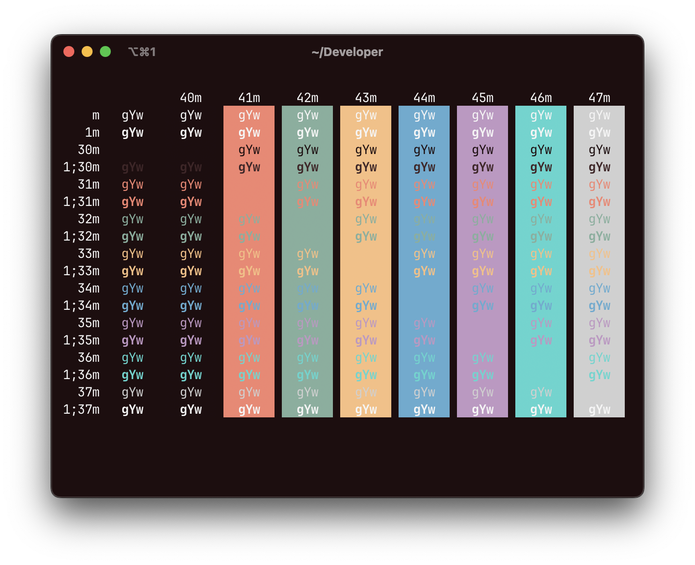

# Kazu

Kazu is a vibrant yet calm color scheme for your terminal of choice: Alacritty, Gnome Terminal, Guake, iTerm, Konsole, mintty, Putty, Terminal.app, XFCE4 Terminal. Also available as Xshell and Xresources files.

Ports of the color scheme for other terminals are welcome!

